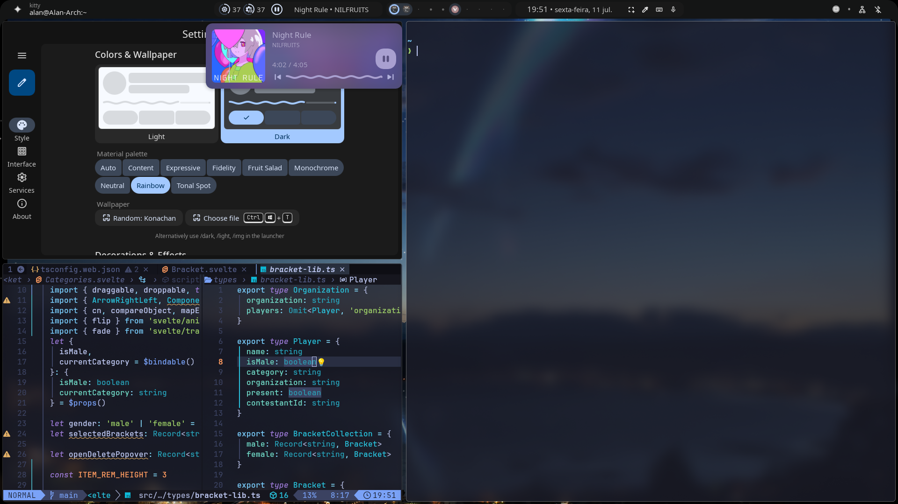

# Quickshell bar and widgets

This config is built on top of [end-4/dots-hyprland](https://github.com/end-4/dots-hyprland). There are minor differences between mine and the original, being some small tweaks in the size of things and the behavior when using multiple monitors

 

